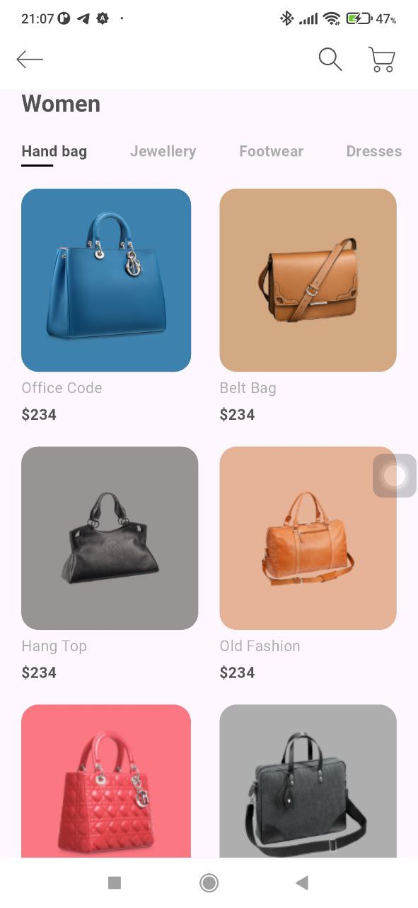
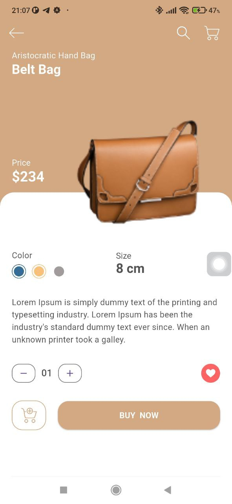

# 🛍️ E-Commerce UI – Flutter Şablonu

Modern ve modüler yapısıyla, Flutter kullanarak geliştirilmiş şık bir e‑ticaret kullanıcı arayüzü şablonu.

## 📸 Ekran Görüntüleri

<div style="display: flex; gap: 10px;">
  
  
</div>


## 🚀 Özellikler

- **Kategori Filtreleme**  
  Yatay kaydırılabilen kategori sekmesi (“Hand Bag”, “Jewellery” vb.)  
- **Ürün Kartları**  
  Görsel, isim ve fiyat; Hero animasyonuyla detay sayfasına geçiş  
- **Detay Ekranı**  
  • Renk ve beden seçimi  
  • Açıklama metni  
  • Adet sayacı ve favori butonu  
  • “Sepete Ekle” butonu  
- **Responsive Tasarım**  
  Ekran boyutuna göre dinamik konumlandırma  
- **Modüler Bileşenler**  
  Her UI parçası ayrı widget dosyasında  

## 🗂 Proje Yapısı

```text
lib/
├── constants.dart              # Renk, padding vb. sabitler
├── main.dart                   # Uygulama başlangıcı, tema ve HomeScreen
├── models/
│   └── Product.dart            # Ürün modeli ve örnek liste
├── screens/
│   ├── home/
│   │   ├── home_screen.dart    # Ana ürün grid’i
│   │   └── components/
│   │       ├── categories.dart # Kategori sekmesi
│   │       └── item_card.dart  # Ürün kartı widget’ı
│   └── details/
│       ├── details_screen.dart # Seçilen ürün detay ekranı
│       └── components/
│           ├── color_and_size.dart
│           ├── description.dart
│           ├── counter_with_fav_btn.dart
│           ├── add_to_cart.dart
│           └── product_title_with_image.dart
